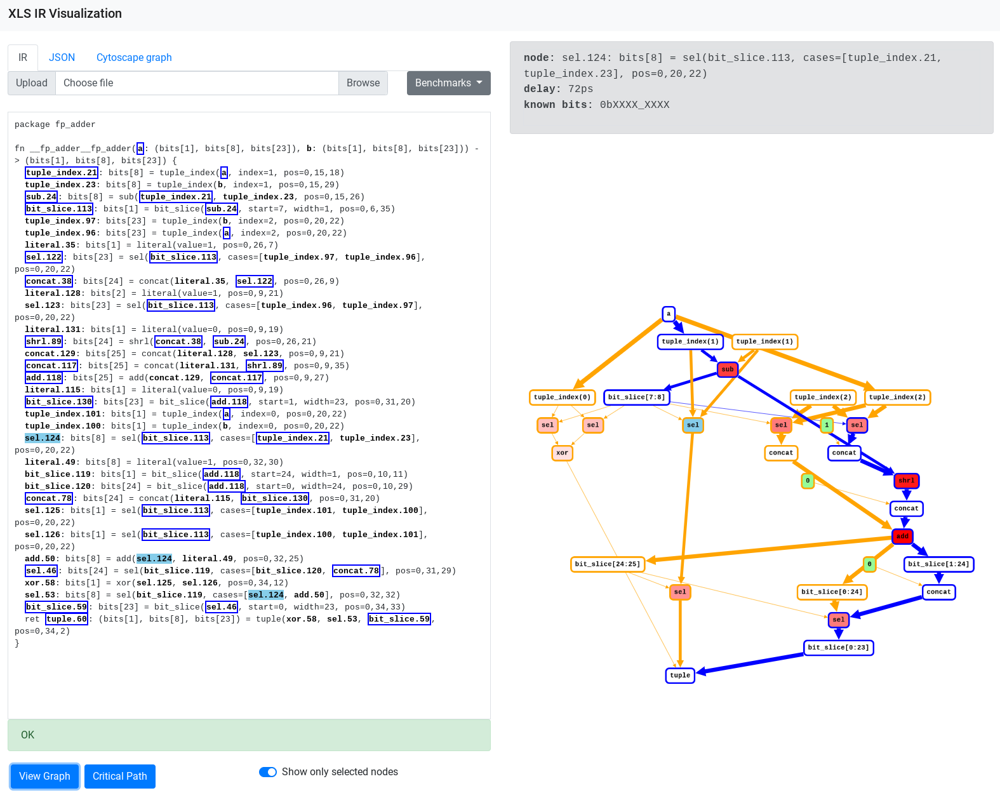

# IR Visualization

The XLS IR visualization
[web app](https://github.com/google/xls/tree/main/xls/visualization/ir_viz/app.py)
presents the IR in text and graphical form side-by-side and enables interactive
exploration of the IR.

## Running the web app

To build and launch the IR visualization web app run:

```shell
bazel run -c opt third_party/xls/visualization/ir_viz:app -- --delay_model=unit
```

Then visit [http://localhost:5000](http://localhost:5000) in a browser.

## Screenshot

The screenshot below shows a zoomed-in portion of the IR graph for the
`fp_adder` benchmark. The highlighted path in blue is the timing critical path
the through the graph.



## Usage

### Text IR

The left hand side of the UI shows the IR in text form in an editable text box.
The IR may be entered or loaded in several ways:

*   Upload from a file on the local file system via the **Upload** button.

*   Enter directly by typing in the text box or cut and pasting.

*   Load a pre-compiled benchmark via the **Benchmarks** button. The IR is from
    the benchmark after optimizations.

The text IR is parsed as you type. The result of the parse (**OK** or an error)
appears in an alert at the bottom of the text box. On successful parsing all
identifiers in the IR will be shown in bold.

### IR graph

The right had side of the UI shows the IR in graphical form. Clicking on the
**View Graph** button renders the text IR on the left hand side as a graph. The
**View Graph** button is enabled only if the IR is parsed successfully. The
graph view may be manipulated as follows:

*   **_Zoom_** The mouse scroll wheel zooms the view of the IR graph.

*   **_Pan_** Clicking and holding the left mouse button down in the graph panel
    (while not on a graph element) and moving the mouse pans the graph.

*   **_Moving nodes_** Nodes in the graph are moved by clicking and holding on
    the node and moving the mouse.

*   **_Focusing on nodes_** Clicking on a node in the graph while holding down
    the control key scrolls the respective definition of the node in the text IR
    into view in the text box. Similarly, control clicking on an identifier in
    the text IR zooms and centers the graph view on the respective node.

#### Node colors

Every node in the graph is assigned a color on a spectrum from white (`#FFFFFF`)
to red (`#FF0000`) depending on the modeled latency of the operation. The nodes
with the longest latency in the graph are assigned red. Nodes with zero latency
are assigned white.

### Hovering on IR elements

Hovering on nodes and edges in the graph highlights the corresponding element in
the text IR and vice versa. In the text IR, the definition and all uses of the
IR value are highlighted when a node is highlighted. When a graph edge is
highlighted, the definition and corresponding use are highlighted in the text
IR.

Information about a highlighted node (identifier in text IR) is displayed in a
box above the IR graph. This information includes:

*   The definition of the IR value in text form.

*   Estimate of the delay in picoseconds of the corresponding operation. The
    delay estimation methodology is described [here](delay_estimation.md).

*   Any known bits of the value as determined by the query engine
    (https://github.com/google/xls/tree/main/xls/passes/query_engine.h).

### Selecting nodes

Nodes in the graph may be in a selected or deselected state. Clicking on a node
in the graph or identifier in the text IR toggles the selection state. A
selected node (identifier in IR text) is shown with a blue border. Nodes and
edges which are neighbors of selected nodes (the selection frontier) are shown
in orange.  Clicking on an empty area of the graph deselects all nodes.

#### Showing only selected nodes

The toggle **Show only selected nodes** controls whether to show the entire
graph or only the selected node and those elements in the selection frontier.
Showing only selected nodes can be used to display only a subgraph of interest.
For large graphs which are slow to render in their entirety, this mechanism can
be used to interactively explore parts of the graph.

When showing only selected nodes, the graph maybe be expanded by selecting
additional nodes to add to the graph. The graph is re-rendered to include the
newly selected node. Similarly, nodes may be removed from the graph by
deselecting nodes.

#### Selecting the critical path

The button **Critical Path** selects exactly those nodes which are on the
critical path as determined by XLS's timing model. This may be used with the
**Show only selected nodes** toggle to show a graph containing only critical
path elements and neighbors. In the screen shot above, the selected critical
path is shown in blue.
